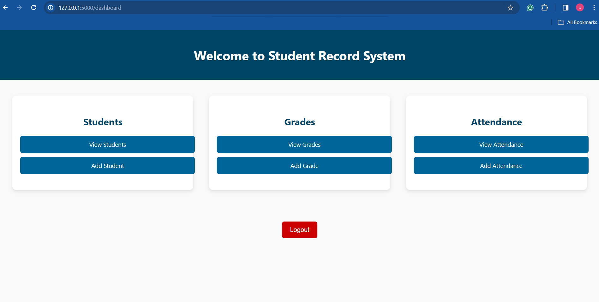
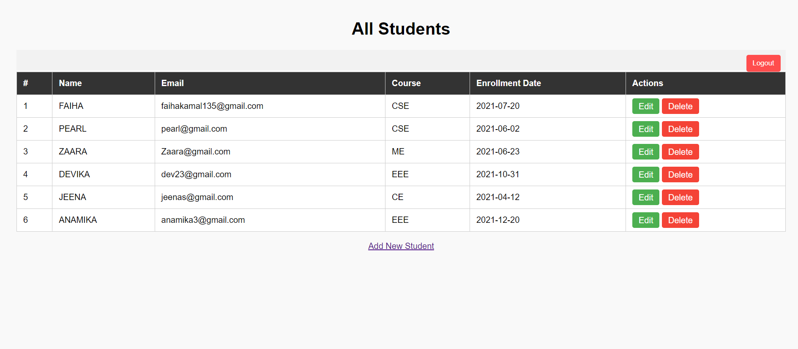
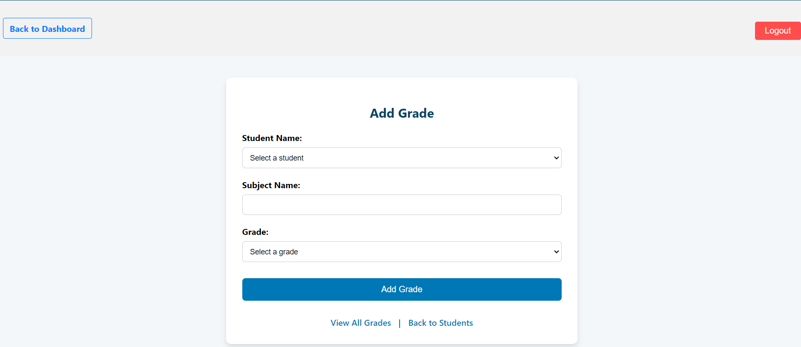
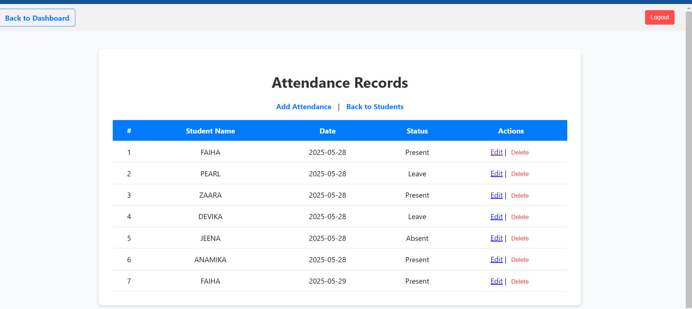

# 🎓 Student Record System


A full-stack web application built using Flask and MySQL for managing student information, grades, and attendance, with secure role-based login functionality.


---


## 📌 Project Description


The **Student Record System** allows schools or colleges to manage their students’:

- Basic details (name, email, course, etc.)

- Grades

- Attendance records


It supports **role-based login** for admins and teachers and stores data in a **cloud-hosted MySQL** database on **Railway**. The system includes user authentication and a clean dashboard UI for navigation.


---


## 🛠️ Tech Stack


| Component       | Technology                |

|-----------------|---------------------------|

| Backend         | Python (Flask)            |

| Database        | MySQL (via Railway)       |

| GUI Tool        | DBeaver                   |

| Hosting         | Railway (Free Tier)       |

| Frontend        | HTML, CSS                 |

| Version Control | Git, GitHub               |


---


## 🔐 Login System


- Two roles: **Admin** and **Teacher**

- Login authentication

- Session-based login and logout

- Passwords hashed for security


---


## 🖥️ Dashboard Overview


The dashboard is divided into three sections:

- 👨‍🎓 **Students**

- 🧮 **Grades**

- 🗓️ **Attendance**


Each section has buttons for full CRUD operations.





---


## 👨‍🎓 Student Management


- Add new students

- View all students

- Edit student details

- Delete student records





---


## 🧮 Grade Management


- Assign grades to students

- View all grades

- Edit grades

- Delete grade entries





---


## 🗓️ Attendance Management


- Add attendance records

- View attendance data

- Edit attendance entries

- Delete attendance records





---


## 🧠 Features


- Role-based secure login

- MySQL database with foreign key relationships

- Aesthetic and intuitive dashboard

- Cloud deployment using Railway

- Modular codebase (separate files for DB, app, templates)


---


## 📂 Folder Structure

Student-Record-System/

│

├── app.py

├── db.py

├── generate_users.py

├── requirements.txt

├── README.md

├── .gitignore

├── templates/

│   ├── login.html

│   ├── dashboard.html

│   ├── add_student.html

│   ├── view_students.html

│   ├── add_grade.html

│   ├── view_grades.html

│   ├── add_attendance.html

│   ├── view_attendance.html

│   └── …

│

├── static/             # optional

├── screenshots/

│   ├── login.png

│   ├── dashboard.png

│   ├── view_students.png

│   ├── add_grade.png

│   ├── view_attendance.png

└── venv/               # virtual environment folder

---


## 🚀 Deployment


### Clone the repository

```bash

git clone https://github.com/your-username/student-record-system.git

cd student-record-system

### Create and activate a virtual environment
```bash

python -m venv venv

venv\Scripts\activate     # On Windows

source venv/bin/activate  # On macOS/Linux

### Install the dependencies
```bash

pip install -r requirements.txt

### Configure your database URL in db.py or an .env file


### Run the application
```bash

python app.py


### Access locally at
```bash

http://127.0.0.1:5000/


